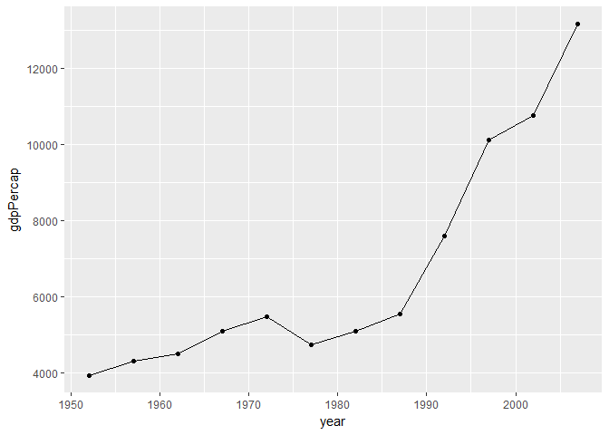
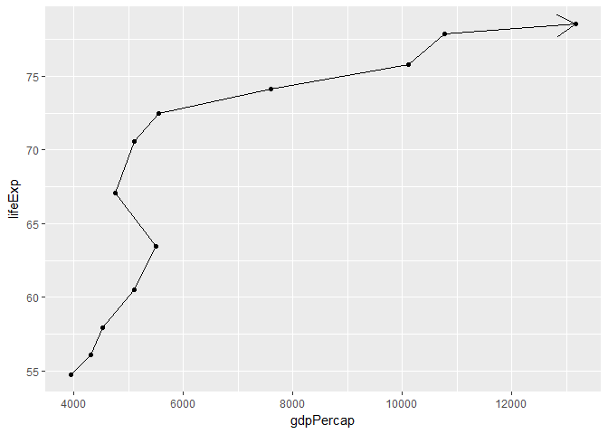
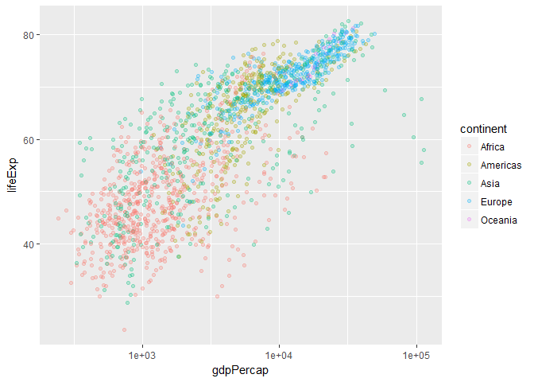
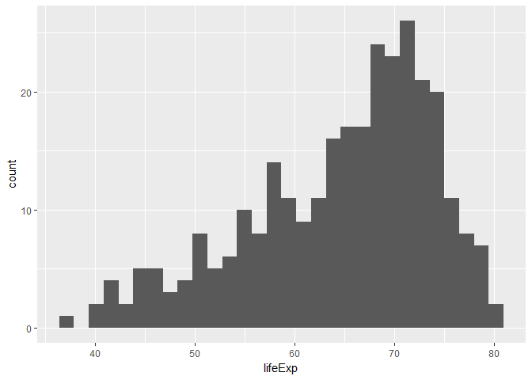
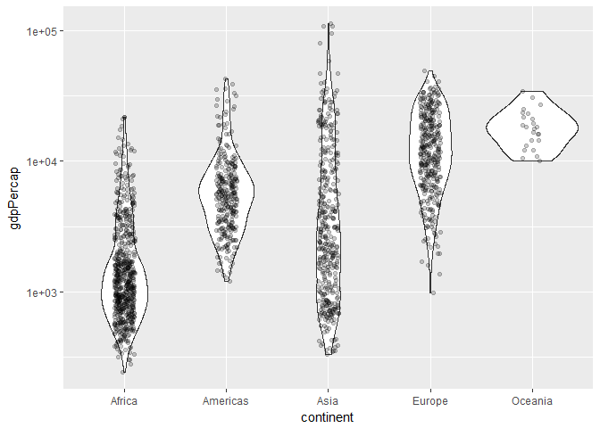
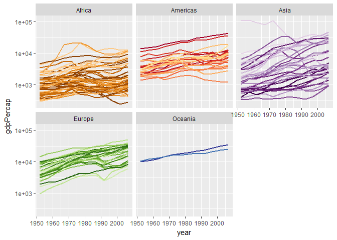
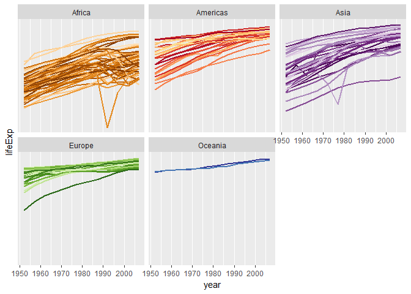

hw02\_gapminder
================
Coni
September 23, 2018

Homework 02: Explore gapminder dataset and use dplyr
====================================================

Load necessary libraries

``` r
library(gapminder)
library(tidyverse)
```

General exploration of the object
---------------------------------

Explore the `gapminder` object

``` r
str(gapminder)
```

    ## Classes 'tbl_df', 'tbl' and 'data.frame':    1704 obs. of  6 variables:
    ##  $ country  : Factor w/ 142 levels "Afghanistan",..: 1 1 1 1 1 1 1 1 1 1 ...
    ##  $ continent: Factor w/ 5 levels "Africa","Americas",..: 3 3 3 3 3 3 3 3 3 3 ...
    ##  $ year     : int  1952 1957 1962 1967 1972 1977 1982 1987 1992 1997 ...
    ##  $ lifeExp  : num  28.8 30.3 32 34 36.1 ...
    ##  $ pop      : int  8425333 9240934 10267083 11537966 13079460 14880372 12881816 13867957 16317921 22227415 ...
    ##  $ gdpPercap: num  779 821 853 836 740 ...

`gapminder` is a Tibble. The class is ‘tbl\_df’, ‘tbl’ and 'data.frame'. It contains 6 variables: `country` (data type: Factor), `continent` (Factor), `year` (integer), `lifeExp` (life expentancy; numrical data type), `pop` (population; integer), and `gdpPercap` (GDP per capita; numerical data type). We have 1704 observations of these variables.

We can also explore the size of the object with `ncol()` and `nrow()`. Thes may be hekpful is we need the length of these lists as the input of a fuction for example.

``` r
ncol(gapminder)
```

    ## [1] 6

``` r
nrow(gapminder)
```

    ## [1] 1704

`dim()` displays the dimensions of the object (number of rows and columns at the same time)

``` r
dim(gapminder)
```

    ## [1] 1704    6

Exploration of individual variables
-----------------------------------

For a basic look at all the variables we can use `summary()`

``` r
summary(gapminder)
```

    ##         country        continent        year         lifeExp     
    ##  Afghanistan:  12   Africa  :624   Min.   :1952   Min.   :23.60  
    ##  Albania    :  12   Americas:300   1st Qu.:1966   1st Qu.:48.20  
    ##  Algeria    :  12   Asia    :396   Median :1980   Median :60.71  
    ##  Angola     :  12   Europe  :360   Mean   :1980   Mean   :59.47  
    ##  Argentina  :  12   Oceania : 24   3rd Qu.:1993   3rd Qu.:70.85  
    ##  Australia  :  12                  Max.   :2007   Max.   :82.60  
    ##  (Other)    :1632                                                
    ##       pop              gdpPercap       
    ##  Min.   :6.001e+04   Min.   :   241.2  
    ##  1st Qu.:2.794e+06   1st Qu.:  1202.1  
    ##  Median :7.024e+06   Median :  3531.8  
    ##  Mean   :2.960e+07   Mean   :  7215.3  
    ##  3rd Qu.:1.959e+07   3rd Qu.:  9325.5  
    ##  Max.   :1.319e+09   Max.   :113523.1  
    ## 

We see for exaple that the variable `gdpPercap` varies between 241.2 and 113523.1 (units are international dollars; [see here](https://cran.r-project.org/web/packages/gapminder/README.html))

For numerical objects we can use `range()` to display the max and min values in the vector

``` r
range(gapminder$gdpPercap)
```

    ## [1]    241.1659 113523.1329

For a categorical object we can use `levels()` to see the categories, or `nlevels()` to get the number of levels

``` r
levels(gapminder$continent)
```

    ## [1] "Africa"   "Americas" "Asia"     "Europe"   "Oceania"

``` r
nlevels(gapminder$continent)
```

    ## [1] 5

But the best way to visualize data is to make a plot.

Trends for Chile
----------------

Plot the gdp vs time for Chile

``` r
gapminder %>%
  filter(country == "Chile") %>%
  ggplot(aes(year, gdpPercap)) +
  geom_line() +
  geom_point()
```



We can also examine how the relationship between gdp and lifeExp changes in time with a path plot

``` r
gapminder %>%
  filter(country == "Chile") %>%
  ggplot(aes(gdpPercap, lifeExp)) +
  geom_point() +
  geom_path(arrow=arrow())
```



### How does the lifeExp changes with gdpPercap?

Let's make a simple scatter plot for all countries

``` r
ggplot(gapminder, aes(x = gdpPercap, y = lifeExp)) +
  geom_point(aes(color = continent), #scatter plot, group by continent
             alpha = 0.25) +
  scale_x_log10() #log scale in x axis (gdp)
```



We can see that `lifeExp` is proportional to the `gdpPercap` (which makes sense; higher income countries tend to have longer life expectancy at birth)

Histogram for Americas
----------------------

``` r
gapminder %>%
  filter(continent == "Americas") %>%
  ggplot(aes(lifeExp)) +
  geom_histogram(bins = 30)
```



gdpPercap vs continent
----------------------

``` r
ggplot(gapminder, aes(x = continent, y = gdpPercap)) +
  geom_violin() +
  geom_jitter(position = position_jitter(width = 0.1, height = 0), alpha = 0.2) +
  scale_y_log10()
```



We see that Oceania shows the highest mean gdp and the lowest spread (although it also has the least ammount of data) Africa has the lowest mean gdp, and Asia has the largest spread.

gdp and lifeExp vs time
-----------------------

We can plot the trends of `gdpPercap` with time for all countries grouped by continent

``` r
ggplot(gapminder, 
       aes(x = year, y = gdpPercap, 
           group = country, 
           color = country)) +
  geom_line(lwd = 1, show.legend = FALSE) + # hide legend (too long)
  facet_wrap(~ continent) + # one plot per contient
  scale_color_manual(values = country_colors) +
  scale_y_log10()
```



Or do the same for the `lifeExp`

``` r
ggplot(gapminder, 
       aes(x = year, y = lifeExp, 
           group = country, 
           color = country)) +
  geom_line(lwd = 1, show.legend = FALSE) + # hide legend (too long)
  facet_wrap(~ continent) + # one plot per continent
  scale_color_manual(values = country_colors) +
  scale_y_log10()
```


